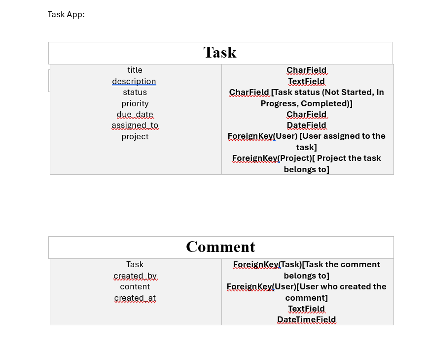
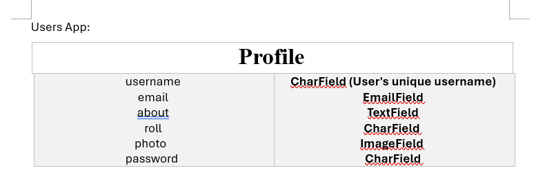

# UNIT-PROJECT-3

**TaskFlow Management System**
- **Description:** A Task Management System designed for teams to collaborate effectively, track tasks, and manage projects with milestones. It will include robust user authentication, role-based access control, task assignments, file uploads, and notifications.

- **Features:**
- **User authentication and role-based access control:** Secure login system with permissions for Admins 
to manage users, projects, and tasks, and Team Members to access assigned tasks.

- **Task creation, assignment, and tracking:** Admins and team members can create tasks, assign them, set priorities and deadlines, and update progress statuses.

- **Project management with milestones:** Organize tasks within projects, define milestones, and track 
progress to meet goals efficiently.

- **File uploads and comments:** Facilitate collaboration by allowing users to upload task-related files and engage in discussions through a comment system.
  
- **Notification system:** Notify users of new assignments, task updates, and approaching deadlines to 
ensure timely completion of work.

**User Story**
1- User Authentication and Role-Based Access Control
    -As a user, I want to securely register and log in, so I can access my tasks and projects safely.
    -As an Admin, I want to manage user roles and permissions, so I can control access to different 
    features.
    -As a Team Member, I want to view and interact only with my assigned tasks and projects, so I stay  
    focused on my responsibilities.

2- Task Creation, Assignment, and Tracking
    -As an Admin, I want to create tasks and assign them to team members, so everyone knows their 
    responsibilities.
    -As a user, I want to update task statuses, so I can track and report progress.
    -As an Admin or Team Member, I want to prioritize tasks by urgency, so critical work is completed   
    first.

3- Project Management with Milestones
    -As an Admin, I want to create projects with milestones, so that I can plan and monitor progress 
    effectively.
    -As a Team Member, I want to view tasks linked to milestones, so that I understand the project 
    goals.
    -As an Admin, I want to track milestone completion, so that I can measure overall progress.

4- File Uploads and Comments
    -As a user, I want to upload files to tasks, so that I can share important documents with the team.
    -As a user, I want to comment on tasks, so that I can discuss progress with my team members.
    -As an Admin, I want to view files and comments, so that I can monitor collaboration.

5- Notification System
   -As a user, I want to be notified of new task assignments, so that I stay updated on my 
    responsibilities.
    -As a user, I want reminders for task deadlines, so that I can manage my time effectively.
    -As an Admin, I want to notify users about task updates, so that the team is informed about changes.

**Model**

## Minimum Requirements
- Use Django.
- Use Templates & Template Inheritance.
- Use static, media & dynamic urls as needed.
- Organize your project in apps as needed.
- Use models to represent you data.
- Use a CSS library to style your website.
- User Authentication & Authorization (register, login, logout, Limit access to some pages using permissions , etc.)
- Use naming conventions & best practices.
- Strive to make the user journey intuitive and complete.

## Use python-dotenv to save your sensitive data.
- https://pypi.org/project/python-dotenv/

## Use a CDN or cloud storage provider to sore your large static files (videos, images, etc.), such as:
- https://firebase.google.com/docs/storage

## Use Git & Github to manage and track changes in your project.
- At lease commit and sync the changes once at the end of everyday.

      
## Resources:

**Free high quality images :**

- https://www.pexels.com/
- https://unsplash.com

**Free sounds website:**

- https://mixkit.co/

**Free stock videos:**

- https://pixabay.com/videos/

**Free Fonts:**

- https://fonts.google.com

**Free Icons**

- https://fonts.google.com/icons
- https://icons.getbootstrap.com/

**CSS Library:**

- https://getbootstrap.com/
- https://get.foundation/index.html

**CSS Animation libraries:**

- https://animate.style
- https://www.minimamente.com/project/magic/

 
